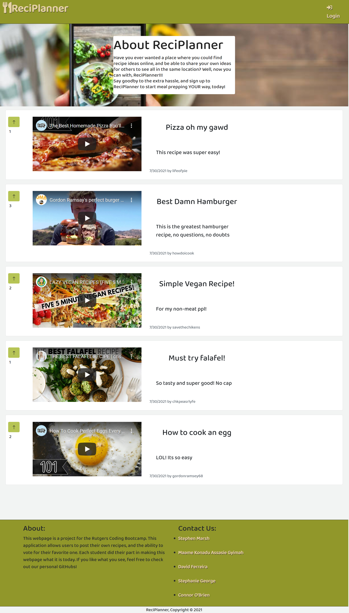
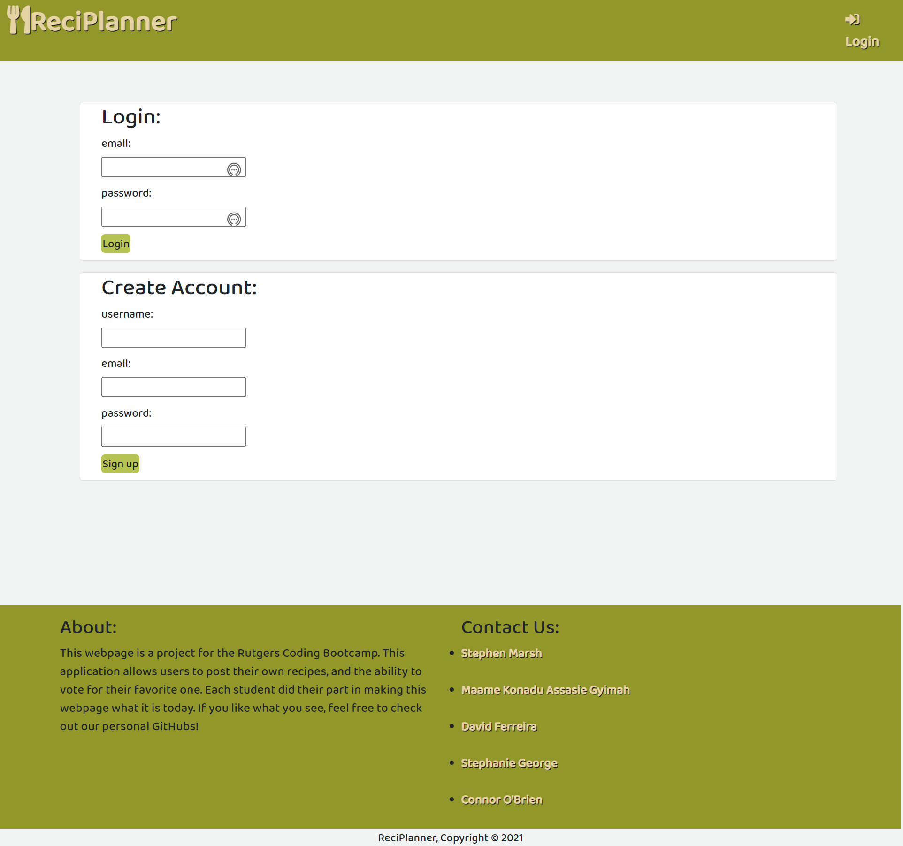
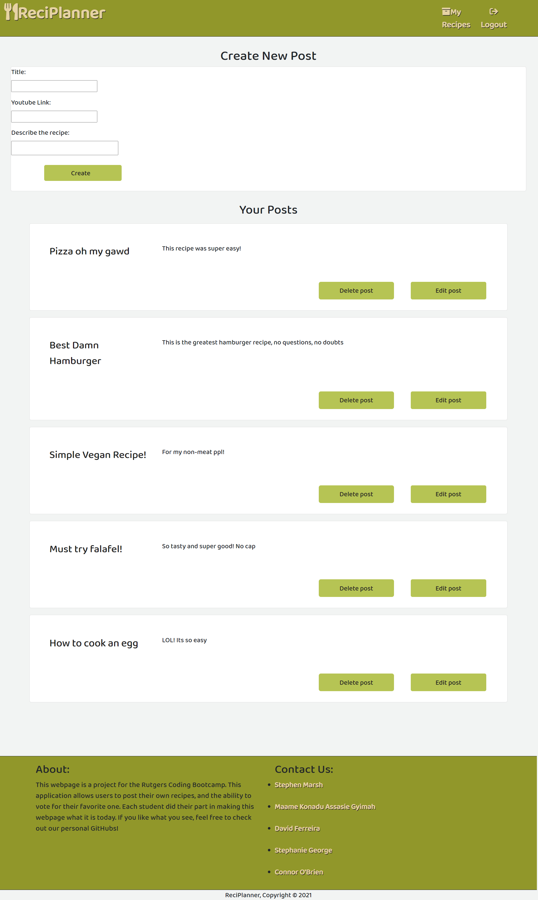
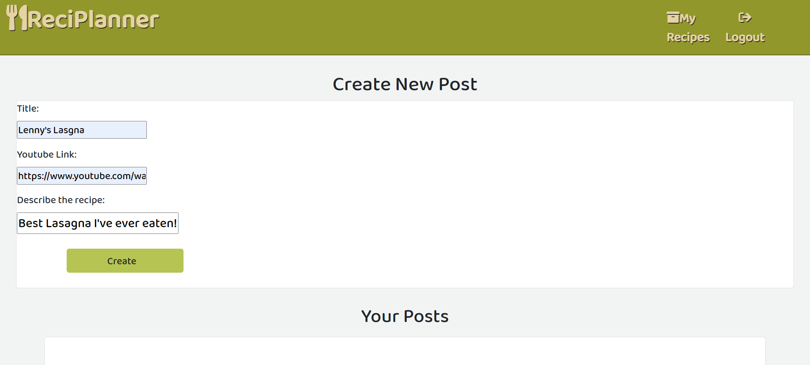
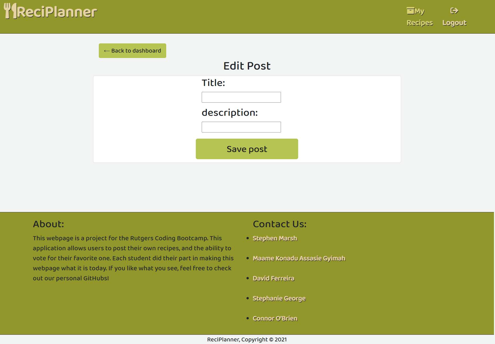
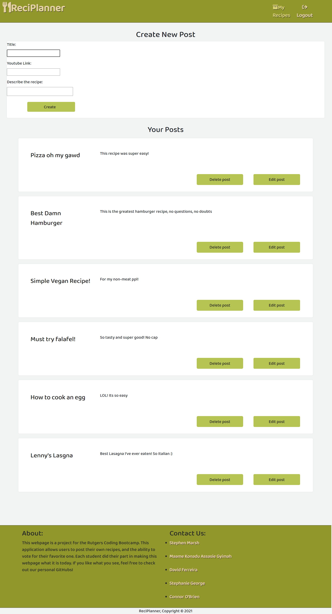
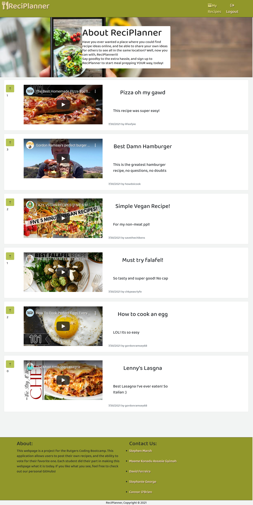

# Reciplanner

This application is the second group project for the Rutgers Coding Bootcamp.

## Description 

Have you ever wanted a place where you could find recipe ideas online, and be able to share your own ideas for others to see all in the same location? Well, now you can with, ReciPlanner!!!

What could be considered the new "Reddit" of recipes and meal plans, ReciPlanner is filled with recipes shared from many users. With a user friendly landing page, you can see which ones are the most popular, and with the upvote system, you can vote which ones are your favorite. Add the ones you like the most to your recipe list, so you can always find them for later. After adding a recipe to ReciPlanner you can share them with others, but don't worry, you can always edit or delete them later! We’ve got a constant stream of YouTube cooking videos for you to checkout, in addition to great meal prep routines!

Say goodby to the extra hassle, and sign up to ReciPlanner to start meal prepping YOUR way, today!  

<!-- Make ACTIVE link -->
Checkout: [ReciPlanner Website](https://JConnrO.github.io/reciplanner/)!

Checkout: [ReciPlanner Slide Presentation](https://docs.google.com/presentation/d/1IMeTyBZ9tJeM5KL94rOKr2wSK1S-RewwTTerx4qfl6I/edit?usp=sharing)

## Table of Contents 

* [Technologies Used](#technologies-used)
* [Usage](#usage)
* [Contributions](#contributions)
* [License](#license)

## Technologies Used

* JavaScript
* Animate.js
* Node.js
* CSS
* HTML
* Express.js
* Sequelize
* Google Fonts

## Usage 

### Landing Page:

When the user first enters the website, they are presented with the landing page.

### Login Page:
 
Upon clicking login the user is brought to the login/create account page. Once the user creates an account they will be able to access their recipes.

### Create Post Page:

On the recipe creation page, the user is presented with the 'Create New Post' card and their post dashboard, with options to delete or edit their posts.

### Create Post Page (with input text):

The user must enter in a title, youtube link, and a description to be able to post.

### Edit Post Page:

The user can also choose to delete or edit past created recipes. When the user clicks edit, they are brought to an edit card, which they are able to enter a new title and description. Once the save button is clicked, the user is brought back to the dashboard.

### My Recipes (with new post):

The user can see the now created post in the dashboard.

### Landing Page (with new post):

When the user clicks the ReciPlanner logo, they are brought back to the landing page with the 'My Recipes' button in the navbar now showing, along with the user's newly created post.

## Contributions

* [Stephen Marsh](https://github.com/Imaparadox)
* [Maame Konadu Assasie Gyimah](https://github.com/maa-hub)
* [David Ferreira](https://github.com/DiSantoz)
* [Stephanie George](https://github.com/stephgeorge22)
* [Connor O'Brien](https://github.com/JConnrO)

## License

MIT License

© 2021 ReciPlanner Inc.

Permission is hereby granted, free of charge, to any person obtaining a copy
of this software and associated documentation files (the "Software"), to deal
in the Software without restriction, including without limitation the rights
to use, copy, modify, merge, publish, distribute, sublicense, and/or sell
copies of the Software, and to permit persons to whom the Software is
furnished to do so, subject to the following conditions:

The above copyright notice and this permission notice shall be included in all
copies or substantial portions of the Software.

THE SOFTWARE IS PROVIDED "AS IS", WITHOUT WARRANTY OF ANY KIND, EXPRESS OR
IMPLIED, INCLUDING BUT NOT LIMITED TO THE WARRANTIES OF MERCHANTABILITY,
FITNESS FOR A PARTICULAR PURPOSE AND NONINFRINGEMENT. IN NO EVENT SHALL THE
AUTHORS OR COPYRIGHT HOLDERS BE LIABLE FOR ANY CLAIM, DAMAGES OR OTHER
LIABILITY, WHETHER IN AN ACTION OF CONTRACT, TORT OR OTHERWISE, ARISING FROM,
OUT OF OR IN CONNECTION WITH THE SOFTWARE OR THE USE OR OTHER DEALINGS IN THE
SOFTWARE.

